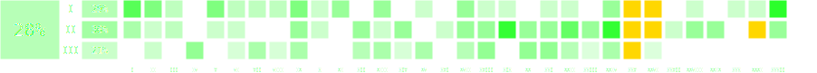

# Maksowanie OI

## Po co mi to repo?
- Żeby łatwiej przygotować się do Olimpiady Informatycznej.
- Żeby uczyć się systematycznie i mierzyć postępy.
- Żeby poznać w praktyce narzędzia programistyczne i linuksowe.

## Co tu jest?
- Automatycznie aktualizująca się checklista pokazująca, które zadania z OI zostały już zrobione.
- Implementacje wszystkich zadań z OI jakie napisałem.
- Przydatne skrypty linuksowe z prostym wyjaśnieniem każdej komendy.
- Krótkie materiały o trickach i narzędziach użytecznych przy pisaniu i testowaniu kodu.


<details>
<summary>Gdzie są jakie pliki?</summary>

📘 Przykład:  
`rozwiazania/xxv/etap3/dzien1/kom/` – rozwiązania do zadania **„Liczby kompletne”** z III etapu XXV OI.


Katalog `rozwiazania/` zawiera wszystkie zadania z OI, które zaimplementowałem.  
Struktura wygląda tak:  
`rozwiazania/<edycja_oi>/<etap_oi>/[dzień_etapu]/<skrót_zadania>/`

- `<skrót>.cpp` – moje rozwiązanie (100 pkt na Szkopule lub SIO2).  
  Dodatki `_alt` lub `_oi` to alternatywne rozwiązania.
- `<skrót><liczba>.cpp` – rozwiązania z mniejszą liczbą punktów (np. bruty lub podgrupy).
- `<skrót>g.cpp` – generatorka testów.
- `<skrót>chk.cpp` – checkerka (jeśli zadanie ma kilka poprawnych odpowiedzi).

Katalog `virtual_contest/` zawiera moje podejścia z symulacji zawodów (ograniczenia czasu i widoczności wyników jak na prawdziwej OI).

Katalogi `checklista` oraz `.github` odpowiadają za automatyczne generowanie checklisty — **nie modyfikuj ich ręcznie.**

Jeśli coś nie działa, daj mi znać przez [Issue](https://github.com/Kulezi/oi/issues).
Chcesz znaleźć konkretne zadanie?  
Zajrzyj na [Listę zadań OI](https://oi.edu.pl/l/oi_zadania/)  
albo użyj:  
```bash
grep 'nazwa_zadania' -R .
```

</details>

<details>
<summary>Jak mam tego używać?</summary>

1. Sforkuj [szablon repozytorium](https://github.com/testowyuczen/oi/fork).  
2. W zakładce **Actions** kliknij  
   `I understand my workflows, go ahead and enable them`  
   — bez tego checklista nie będzie się aktualizować automatycznie.

### Automatyczny import zadań ze Szkopuła
Skrypt [oi-fetcher](https://github.com/Matian37/oi-fetcher) pozwala zgrać wszystkie rozwiązania z [Archiwum OI](https://szkopul.edu.pl/task_archive/oi/).  
Zadania z konkursów trzeba dodać ręcznie.  
Kudos dla [@Matian37](https://github.com/Matian37) za narzędzie.

### Dodawanie nowych rozwiązań
Załóżmy, że zrobiłeś zadanie ['Rycerz' z II etapu XXXI OI](https://oi.edu.pl/archive/pl/oi/31/ryc):

```bash
git add rozwiazania/xxxi/etap2/dzien1/ryc/ryc.cpp
git commit -m "Dodano rozwiązanie zadania 'Rycerz' z XXXI OI"
git push
```

Po kilku minutach checklista na GitHubie zaktualizuje się automatycznie.  
Jeśli chcesz pobrać nową wersję checklisty lokalnie:
```bash
git pull
```
</details>
<!-- AUTO-CHECKLIST -->

> ⚠️ **UWAGA:** Sekcja poniżej jest generowana automatycznie.
> Nie modyfikuj README poniżej tego napisu.
> ✅ oznacza wykonane zadanie.
> 🤔 oznacza zadanie z mniej niż 100 punktów.


# Podsumowanie

## Rozwiązane zadania wg etapów

Etap I | Etap II | Etap III | Łącznie
:---: | :---: | :---: | :---:
43/150 (29%) | 54/157 (34%) | 42/200 (21%) | 139/507 (27%)

## Rozwiązane zadania wg edycji

Edycja | Wynik | Edycja | Wynik | Edycja | Wynik | Edycja | Wynik
:--- | ---: | :--- | ---: | :--- | ---: | :--- | ---:
I | 3/10 (30%) | XI | 2/16 (12%) | XXI | 6/17 (35%) | XXXI | 5/17 (29%)
II | 4/14 (29%) | XII | 4/17 (24%) | XXII | 6/17 (35%) | XXXII | 7/18 (39%)
III | 2/13 (15%) | XIII | 5/16 (31%) | XXIII | 3/17 (18%) |  | 
IV | 3/16 (19%) | XIV | 3/16 (19%) | XXIV | 7/16 (44%) |  | 
V | 3/16 (19%) | XV | 3/16 (19%) | XXV | 18/18 (100%) |  | 
VI | 3/15 (20%) | XVI | 1/16 (6%) | XXVI | 11/17 (65%) |  | 
VII | 3/15 (20%) | XVII | 6/17 (35%) | XXVII | 1/10 (10%) |  | 
VIII | 2/15 (13%) | XVIII | 5/17 (29%) | XXVIII | 3/17 (18%) |  | 
IX | 6/15 (40%) | XIX | 4/17 (24%) | XXIX | 2/17 (12%) |  | 
X | 2/16 (12%) | XX | 5/17 (29%) | XXX | 1/17 (6%) |  |


<details>
<summary>Rozwiązane zadania z I etapu</summary>

Edycja | zad. 1 | zad. 2 | zad. 3 | zad. 4 | zad. 5 | zad. 6
:--- | ---: | ---: | ---: | ---: | ---: | ---:
I | pio ✅ | tro ✅ |   | — | — | —
II | jed ✅ | pal ✅ |   |   | — | —
III | gon ✅ |   |   |   | — | —
IV |   |   |   |   | — | —
V | sum ✅ | wie ✅ |   |   | — | —
VI | gra ✅ |   |   |   | — | —
VII | bro ✅ |   |   |   | — | —
VIII | ant ✅ |   |   |   | — | —
IX | kom ✅ | kol ✅ |   |   | — | —
X | cze ✅ |   |   |   |   | —
XI | zaw ✅ | gra ✅ |   |   |   | —
XII |   |   |   |   |   | —
XIII | kra ✅ | okr ✅ |   |   |   | —
XIV |   |   |   |   |   | —
XV | pla ✅ |   |   |   |   | —
XVI |   |   |   |   |   | —
XVII | kor ✅ | tes ✅ |   |   |   | —
XVIII | liz ✅ |   |   |   |   | —
XIX | odl ✅ |   |   |   |   | —
XX |   |   |   |   |   | —
XXI | kur ✅ |   |   |   |   | —
XXII | kin ✅ |   |   |   |   | —
XXIII |   |   |   |   |   | —
XXIV | fla ✅ |   |   |   |   | —
XXV | pow ✅ | roz ✅ | pra ✅ | pla ✅ | pio ✅ | —
XXVI | rob ✅ | klu ✅ | par ✅ | nie ✅ | pod ✅ | —
XXVII |   |   |   |   |   | —
XXVIII | gan ✅ |   |   |   |   | —
XXIX |   |   |   |   |   | —
XXX | kol ✅ |   |   |   |   | —
XXXI | cza ✅ |   |   |   |   | —
XXXII | bit ✅ | wal ✅ | spr ✅ | zam ✅ | usu ✅ | kas 🤔
</details>


<details>
<summary>Rozwiązane zadania z II etapu</summary>

Edycja | zad. próbne | Dzień 1 - zad. 1 | Dzień 1 - zad. 2 | Dzień 2 - zad. 1 | Dzień 2 - zad. 2
:--- | ---: | ---: | ---: | ---: | ---:
I |   | prz ✅ | — |   | —
II |   | tro ✅ |   |   |  
III |   |   | — | haz ✅ |  
IV |   |   |   |   |  
V |   | row ✅ |   |   |  
VI |   | lun ✅ |   |   |  
VII |   |   |   |   |  
VIII |   |   |   |   |  
IX | izo ✅ | dzi ✅ |   |   |  
X |   | aut ✅ |   |   |  
XI |   |   |   |   |  
XII |   | ban ✅ |   | kos ✅ |  
XIII |   | naj ✅ |   |   |  
XIV |   | ska ✅ |   | tet ✅ |  
XV |   |   |   |   |  
XVI |   |   |   | arc ✅ |  
XVII |   | cho ✅ | klo ✅ |   |  
XVIII |   | roz ✅ |   |   |  
XIX |   | sza ✅ |   | roz ✅ | okr ✅
XX |   | luk ✅ |   | mor ✅ |  
XXI |   | prz ✅ |   | pta ✅ |  
XXII |   | pus ✅ |   | trz ✅ | kur ✅
XXIII |   | dro ✅ | zaj ✅ |   |  
XXIV |   | sum ✅ | str ✅ | kon ✅ | zam ✅
XXV | prz ✅ | dro ✅ | kon ✅ | tom ✅ | tel ✅
XXVI | roz ✅ | gwi ✅ | kol ✅ | cyk ✅ | osi ✅
XXVII |   | czw ✅ |   |   |  
XXVIII |   | ple ✅ |   | pla ✅ |  
XXIX |   |   |   | kon ✅ | bom ✅
XXX |   |   |   |   |  
XXXI |   | lic ✅ | ryc ✅ | cia ✅ | poj ✅
XXXII | sss ✅ | drz ✅ |   |   |
</details>


<details>
<summary>Rozwiązane zadania z III etapu</summary>

Edycja | Dzień próbny, zad. 1 | Dzień próbny, zad. 2 | Dzień 1 - zad. 1 | Dzień 1 - zad. 2 | Dzień 1 - zad. 3 | Dzień 2 - zad. 1 | Dzień 2 - zad. 2 | Dzień 2 - zad. 3
:--- | ---: | ---: | ---: | ---: | ---: | ---: | ---: | ---:
I |   | — |   |   | — |   | — | —
II |   | — |   |   | — | sze ✅ |   | —
III |   | — |   |   | — |   |   | —
IV |   | — | kaj ✅ | tro ✅ |   | rez ✅ |   | —
V |   | — |   |   |   |   |   |  
VI |   | — | mag ✅ |   | — |   |   |  
VII |   | — |   |   | — | pow ✅ | age ✅ |  
VIII |   | — |   |   | — | kop ✅ |   |  
IX | min ✅ | — |   |   | — | szy ✅ |   |  
X |   | — |   |   | — |   |   |  
XI |   | — |   |   |   |   |   | —
XII | dzi ✅ | — |   |   |   | aut ✅ |   |  
XIII |   | — |   |   | — | pal ✅ | zos ✅ |  
XIV |   | — |   |   | — | klo ✅ |   |  
XV |   | — | kup ✅ |   |   | sta ✅ |   | —
XVI |   | — |   |   |   |   |   | —
XVII |   | — | zab ✅ |   |   | pil ✅ |   |  
XVIII |   | — | imp ✅ |   |   | pat ✅ | met ✅ |  
XIX |   | — |   |   |   |   |   |  
XX |   | — | lan ✅ | baj ✅ |   | gdz ✅ |   |  
XXI | far ✅ | — | tur ✅ |   |   | pan ✅ |   |  
XXII |   | — | wil ✅ |   |   | kol ✅ |   |  
XXIII |   | — | zyw ✅ |   |   |   |   |  
XXIV | piz ✅ | — | zap ✅ |   |   |   |   | —
XXV | trz ✅ | dwa ✅ | tur ✅ | kom ✅ | ogr ✅ | ddl ✅ | tak ✅ | wie ✅
XXVI |   | — |   |   |   | dlu ✅ |   |  
XXVII | — | — | — | — | — | — | — | —
XXVIII |   | — |   |   |   |   |   |  
XXIX |   |   |   |   |   |   |   |  
XXX |   | — |   |   |   |   |   |  
XXXI |   | — |   |   |   |   |   |
</details>
