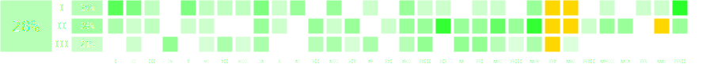

# Materiały przygotowujące do Olimpiady Informatycznej.

## Repozytorium ma na celu:
- Przekazanie wiedzy przydatnej w Olimpiadzie Informatycznej dla wszystkich chętnych do nauki.
- Promowanie systematycznego podejścia do treningu i zdrowych nawyków.
- Zapewnienie prostych, przystępnych narzędzi do mierzenia swojego progresu
- Naukę powszechnie stosowanych narzędzi programistycznych poprzez praktykę.

## Repozytorium zawiera:
- Rozwiązania zadań z Olimpiady Informatycznej, które napisałem, często alternatywne do omówień ze strony OI.
- Skrypty linuksowe przydatne na olimpiadzie z prostym wytłumaczeniem każdej instrukcji.
- Krótkie wykłady na temat korzystania z narzędzi linuksowych przydatnych w pisaniu i testowaniu zadań.
- Automatycznie aktualizujący się licznik rozwiązanych zadań oraz tabelę pokazującą, 
które zadania z każdej z edycji OI zostały już rozwiązane z podziałem na etapy olimpiady. 
Przydaje się to do mierzenia progresu, oraz do doboru zadań na treningu. 
- Odnośniki do innych przydatnych źródeł.

## Struktura repozytorium:

Zawartości katalogów `skrypty`, oraz `materialy` łatwo się domyślić, zachęcam do zapoznania się z nią.
W katalogu `rozwiazania` znajdziesz wszystkie rozwiązania zadań z OI, które zaimplementowałem.
Katalog `rozwiazania/<edycja_oi>/<etap_oi>/[dzień_etapu]/<skrót zadania>` zawiera pliki dotyczące danego zadania z OI.
- `<skrót zadania>.cpp` - moje rozwiązanie zadania, które otrzymuje 100 pkt na testach na sio2/szkopule, 
        dodatkowo z dopiskiem `_alt` bądź `_oi` pojawiają się czasem rozwiązania alternatywne oraz wprost z omówienia zadania,
        w przypadkach gdy rozwiązałem zadanie na 100 punktów na kilka różnych sposobów.
- `<skrót zadania><liczba punktów>.cpp` - Rozwiązania, które dostają mniej niż 100 punktów, takie jak bruty, bądź rozwiązania podgrup.
I dosyć często również pliki: 
- `<skrót zadania>g.cpp` - moja generatorka do zadania, której używałem testując rozwiązanie.
- `<skrót zadania>chk.cpp` - moja czekerka w przypadku zadań, w których istnieje więcej niż jedno poprawne rozwiązanie inne niż generowane przez bruta.
- Katalog `virtual_contest/`, zawierający moje skrypty, generatorki, czekerki i różne podejścia do zadania w przypadku, gdy symulowałem ograniczenia czasu i widoczności werdyktów występujące na olimpiadzie, tzn. w przypadku etapów I i II olimpiady, nie mogłem poznać liczby punktów, które dostanie moje zadanie na sprawdzarce szkopuł. Testowałem rozwiązanie lokalnie, i wysyłałem dopiero po przetestowaniu. Rozwiązania zadań z III etapu mogłem wysłać do 10 rozwiązań na szkopuła poznając ich wynik.

Katalogi `checklista` oraz `.github` zawierają skrypty automatycznie generujące checklisty, nie należy ich modyfikować. 
Jeśli coś nie działa, daj mi znać przez [Issue](https://github.com/Kulezi/oi/issues) na GitHubie.

Przykładowo katalog `rozwiazania/xxv/etap3/dzien1/kom/` będzie zawierał moje rozwiązania do zadania 'Liczby kompletne' z III etapu XXV OI.
Rozwiązania konkretnego zadanie można łatwo znaleźć sprawdzając, z której edycji i etapu olimpiady jest na [Liście zadań OI](https://oi.edu.pl/l/oi_zadania/),
bądź przy pomocy polecenia `grep 'nazwa zadania' -R .` wywołanego z głównego katalogu repozytorium, np. `grep `Trójkąty` -R .`.

## Jak samemu skorzystać z checklisty:
Sforkuj [szablon](https://github.com/testowyuczen/oi) tego repozytorium [klikając tutaj](https://github.com/testowyuczen/oi/fork), i w zakładce Actions swojego repozytorium kliknij `I understand my workflows, go ahead and enable them` - bez tego checklista nie będzie się aktualizować automatycznie.

Po wbiciu jakiegoś zadania, np ['Rycerz' z pierwszego dnia II etapu XXXI OI](https://oi.edu.pl/archive/pl/oi/31/ryc):
- Zapisz rozwiązanie. np. w pliku `rozwiazania/xxxi/etap2/dzien1/ryc/ryc.cpp`.
- Dodaj je do repozytorium wykonując `git add `rozwiazania/xxxi/etap2/dzien1/ryc/ryc.cpp`, (przy pomocy `git status` możesz zobaczyć co już dodałeś w tym commicie).
- Scommituj je np. w ten sposób: `git commit -m "Dodano rozwiązanie zadania 'Rycerz' z XXXI OI"` (jeśli zapomnieliśmy czegoś dodać wystarczy powtórzyć poprzedni krok i użyć `git commit --am`.
- Zaktualizuj repozytorium na GitHub o lokalne zmiany przy pomocy `git push`, ewentualnie `git push -f`.
- Checklista w `README.md` na GitHub zaktualizuje się automatycznie w ciągu kilku minut.
- `git pull` wciągnie aktualną wersję checklisty z GitHuba (bez tego będziesz potrzebował robić `git push -f` przy każdym pushu.

<!-- AUTO-CHECKLIST -->

> ⚠️ **UWAGA:** Sekcja poniżej jest generowana automatycznie.
> Nie modyfikuj README poniżej tego napisu.
> ✅ oznacza wykonane zadanie.
> 🤔 oznacza zadanie z mniej niż 100 punktów.

# Podsumowanie

## Rozwiązane zadania wg etapów

Etap I | Etap II | Etap III | Łącznie
:---: | :---: | :---: | :---:
42/150 (28%) | 48/157 (31%) | 40/200 (20%) | 130/507 (26%)

## Rozwiązane zadania wg edycji

Edycja | Wynik | Edycja | Wynik | Edycja | Wynik | Edycja | Wynik
:--- | ---: | :--- | ---: | :--- | ---: | :--- | ---:
I | 3/10 (30%) | XI | 2/16 (12%) | XXI | 6/17 (35%) | XXXI | 4/17 (24%)
II | 4/14 (29%) | XII | 4/17 (24%) | XXII | 4/17 (24%) | XXXII | 7/18 (39%)
III | 2/13 (15%) | XIII | 5/16 (31%) | XXIII | 3/17 (18%) |  | 
IV | 3/16 (19%) | XIV | 3/16 (19%) | XXIV | 6/16 (38%) |  | 
V | 3/16 (19%) | XV | 3/16 (19%) | XXV | 17/18 (94%) |  | 
VI | 3/15 (20%) | XVI | 1/16 (6%) | XXVI | 10/17 (59%) |  | 
VII | 3/15 (20%) | XVII | 6/17 (35%) | XXVII | 1/10 (10%) |  | 
VIII | 2/15 (13%) | XVIII | 5/17 (29%) | XXVIII | 3/17 (18%) |  | 
IX | 6/15 (40%) | XIX | 4/17 (24%) | XXIX | 1/17 (6%) |  | 
X | 1/16 (6%) | XX | 4/17 (24%) | XXX | 1/17 (6%) |  |

## Rozwiązane zadania z I etapu

Edycja | zad. 1 | zad. 2 | zad. 3 | zad. 4 | zad. 5 | zad. 6
:--- | ---: | ---: | ---: | ---: | ---: | ---:
I | pio ✅ | tro ✅ |   | — | — | —
II | jed ✅ | pal ✅ |   |   | — | —
III | gon ✅ |   |   |   | — | —
IV |   |   |   |   | — | —
V | wie ✅ | sum ✅ |   |   | — | —
VI | gra ✅ |   |   |   | — | —
VII | bro ✅ |   |   |   | — | —
VIII | ant ✅ |   |   |   | — | —
IX | kom ✅ | kol ✅ |   |   | — | —
X |   |   |   |   |   | —
XI | gra ✅ | zaw ✅ |   |   |   | —
XII |   |   |   |   |   | —
XIII | kra ✅ | okr ✅ |   |   |   | —
XIV |   |   |   |   |   | —
XV | pla ✅ |   |   |   |   | —
XVI |   |   |   |   |   | —
XVII | kor ✅ | tes ✅ |   |   |   | —
XVIII | liz ✅ |   |   |   |   | —
XIX | odl ✅ |   |   |   |   | —
XX |   |   |   |   |   | —
XXI | kur ✅ |   |   |   |   | —
XXII | kin ✅ |   |   |   |   | —
XXIII |   |   |   |   |   | —
XXIV | fla ✅ |   |   |   |   | —
XXV | roz ✅ | pow ✅ | pio ✅ | pla ✅ | pra ✅ | —
XXVI | pod ✅ | nie ✅ | rob ✅ | klu ✅ | par ✅ | —
XXVII |   |   |   |   |   | —
XXVIII | gan ✅ |   |   |   |   | —
XXIX |   |   |   |   |   | —
XXX | kol ✅ |   |   |   |   | —
XXXI | cza ✅ |   |   |   |   | —
XXXII | wal ✅ | kas 🤔 | spr ✅ | usu ✅ | zam ✅ | bit ✅

## Rozwiązane zadania z II etapu

Edycja | zad. próbne | Dzień 1 - zad. 1 | Dzień 1 - zad. 2 | Dzień 2 - zad. 1 | Dzień 2 - zad. 2
:--- | ---: | ---: | ---: | ---: | ---:
I |   | prz ✅ | — |   | —
II |   | tro ✅ |   |   |  
III |   |   | — | haz ✅ |  
IV |   |   |   |   |  
V |   | row ✅ |   |   |  
VI |   | lun ✅ |   |   |  
VII |   |   |   |   |  
VIII |   |   |   |   |  
IX | izo ✅ | dzi ✅ |   |   |  
X |   | aut ✅ |   |   |  
XI |   |   |   |   |  
XII |   | ban ✅ |   | kos ✅ |  
XIII |   | naj ✅ |   |   |  
XIV |   | ska ✅ |   | tet ✅ |  
XV |   |   |   |   |  
XVI |   |   |   | arc ✅ |  
XVII |   | klo ✅ | cho ✅ |   |  
XVIII |   | roz ✅ |   |   |  
XIX |   | sza ✅ |   | roz ✅ | okr ✅
XX |   | luk ✅ |   | mor ✅ |  
XXI |   | prz ✅ |   | pta ✅ |  
XXII |   | pus ✅ |   |   |  
XXIII |   | zaj ✅ | dro ✅ |   |  
XXIV |   | sum ✅ |   | kon ✅ | zam ✅
XXV | prz ✅ | kon ✅ | dro ✅ | tom ✅ | tel ✅
XXVI |   | kol ✅ | gwi ✅ | osi ✅ | roz 🤔
XXVII |   | czw ✅ |   |   |  
XXVIII |   | ple ✅ |   | pla ✅ |  
XXIX |   |   |   | kon ✅ |  
XXX |   |   |   |   |  
XXXI |   | lic ✅ | ryc ✅ | poj ✅ |  
XXXII | sss ✅ | drz ✅ |   |   |

## Rozwiązane zadania z III etapu

Edycja | Dzień próbny, zad. 1 | Dzień próbny, zad. 2 | Dzień 1 - zad. 1 | Dzień 1 - zad. 2 | Dzień 1 - zad. 3 | Dzień 2 - zad. 1 | Dzień 2 - zad. 2 | Dzień 2 - zad. 3
:--- | ---: | ---: | ---: | ---: | ---: | ---: | ---: | ---:
I |   | — |   |   | — |   | — | —
II |   | — |   |   | — | sze ✅ |   | —
III |   | — |   |   | — |   |   | —
IV |   | — | kaj ✅ | tro ✅ |   | rez ✅ |   | —
V |   | — |   |   |   |   |   |  
VI |   | — | mag ✅ |   | — |   |   |  
VII |   | — |   |   | — | age ✅ | pow ✅ |  
VIII |   | — |   |   | — | kop ✅ |   |  
IX | min ✅ | — |   |   | — | szy ✅ |   |  
X |   | — |   |   | — |   |   |  
XI |   | — |   |   |   |   |   | —
XII | dzi ✅ | — |   |   |   | aut ✅ |   |  
XIII |   | — |   |   | — | zos ✅ | pal ✅ |  
XIV |   | — |   |   | — | klo ✅ |   |  
XV |   | — | kup ✅ |   |   | sta ✅ |   | —
XVI |   | — |   |   |   |   |   | —
XVII |   | — | zab ✅ |   |   | pil ✅ |   |  
XVIII |   | — | imp ✅ |   |   | pat ✅ | met ✅ |  
XIX |   | — |   |   |   |   |   |  
XX |   | — | lan ✅ |   |   | gdz ✅ |   |  
XXI | far ✅ | — | tur ✅ |   |   | pan ✅ |   |  
XXII |   | — | wil ✅ |   |   | kol ✅ |   |  
XXIII |   | — | zyw ✅ |   |   |   |   |  
XXIV | piz ✅ | — | zap ✅ |   |   |   |   | —
XXV | trz 🤔 | dwa ✅ | ogr ✅ | kom ✅ | tur ✅ | wie ✅ | tak ✅ | ddl ✅
XXVI |   | — |   |   |   | dlu ✅ |   |  
XXVII | — | — | — | — | — | — | — | —
XXVIII |   | — |   |   |   |   |   |  
XXIX |   |   |   |   |   |   |   |  
XXX |   | — |   |   |   |   |   |  
XXXI |   | — |   |   |   |   |   |
